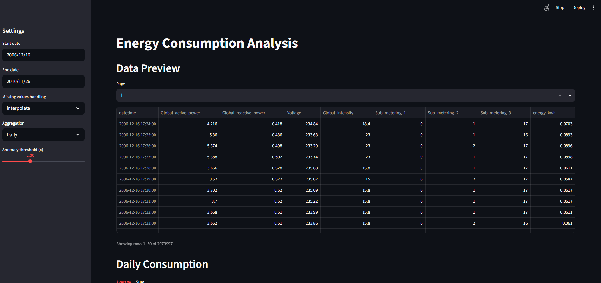
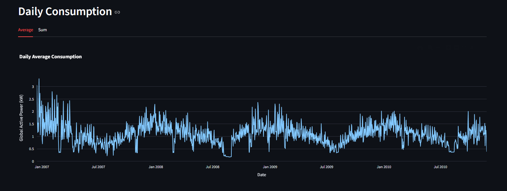
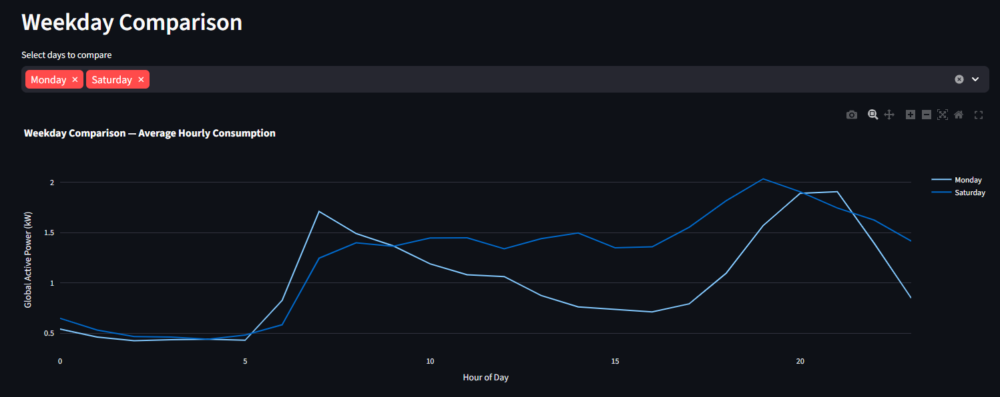
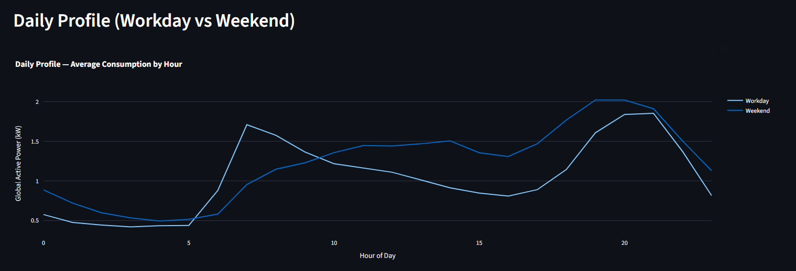
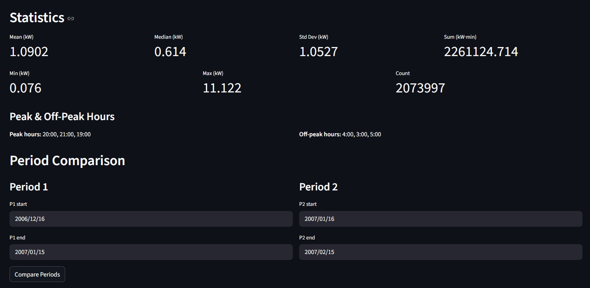
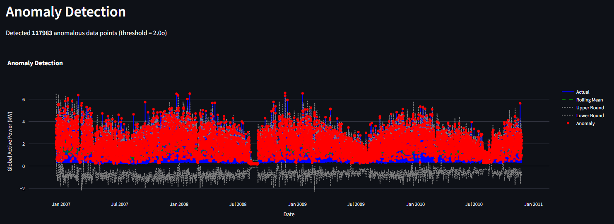
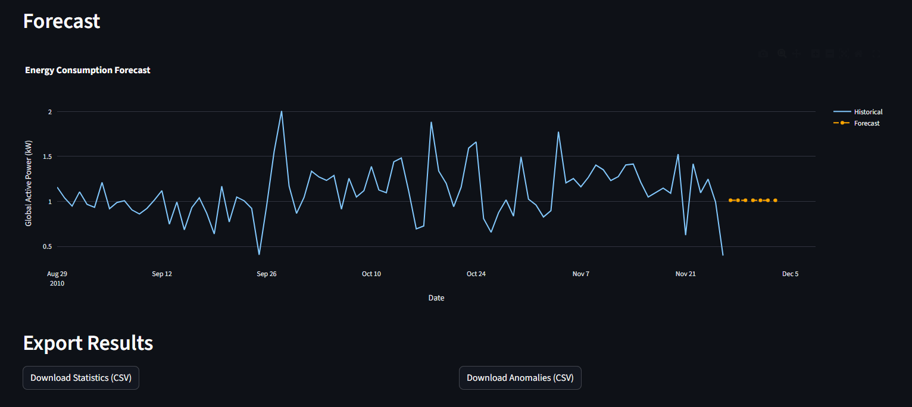

# Aplikacja do analizy zużycia energii
# Energy Consumption Analysis Application

## Opis projektu / Project Description

Aplikacja do analizy danych z licznika energii. Umożliwia wczytywanie danych CSV,
wizualizację zużycia energii, wykrywanie anomalii oraz prostą prognozę przyszłego zużycia.

## Struktura projektu / Project Structure

```
energy-consumption-analysis/
├── data/                    # Dane wejściowe (CSV)
│   └── raw/                 # Surowe dane z licznika
├── src/                     # Kod źródłowy
│   ├── __init__.py
│   ├── data_loader.py       # Wczytywanie i walidacja danych CSV
│   ├── preprocessing.py     # Czyszczenie i przygotowanie danych
│   ├── analysis.py          # Analiza statystyczna zużycia
│   ├── visualization.py     # Generowanie wykresów
│   ├── anomaly_detection.py # Wykrywanie anomalii
│   └── forecasting.py       # Prognoza zużycia energii
├── app.py                   # Główna aplikacja Streamlit
├── requirements.txt         # Zależności Pythona
├── README.md
└── .gitignore
```

## Instalacja / Installation

```bash
python -m venv venv
venv\Scripts\activate        # Windows
pip install -r requirements.txt
```

## Uruchomienie / Running

```bash
python -m streamlit run app.py
```

## Dane / Data

Źródło danych: Kaggle (szczegóły w dokumentacji).
Format: CSV z kolumnami timestamp + zużycie energii (kWh).

## Technologie / Tech Stack

- Python 3.10+
- pandas, numpy — przetwarzanie danych
- matplotlib, seaborn, plotly — wizualizacja
- scikit-learn, statsmodels — prognoza i wykrywanie anomalii
- Streamlit — interfejs webowy

## Screenshots

### Main View
Data preview with filtering by date range, missing value handling and aggregation settings.



### Daily Consumption
Daily aggregated energy consumption chart (average and total).



### Weekday Comparison
Comparison of average hourly consumption between selected days of the week.



### Daily Profile (Workday vs Weekend)
Average consumption by hour with workday/weekend split.



### Statistics & Period Comparison
Basic statistics (mean, median, min, max, std) and period-over-period comparison.



### Anomaly Detection
Detected anomalies highlighted on the consumption chart with configurable threshold.



### Forecast & Export
Energy consumption forecast and CSV export of results.


